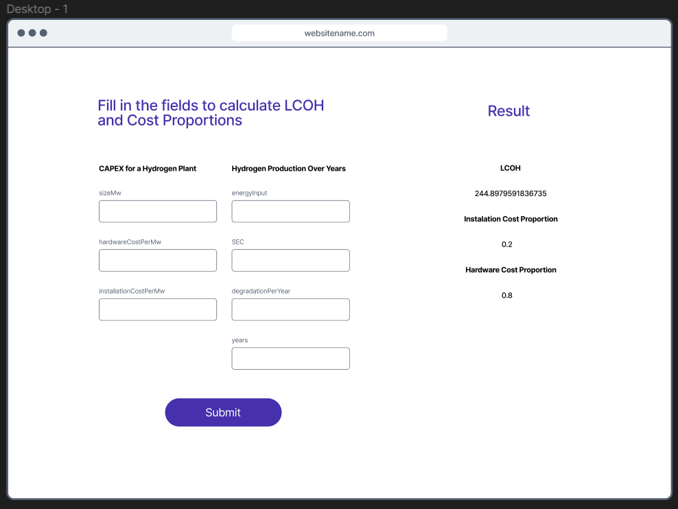

This is the code for the Southern Lights Frontend Developer Role Assignment

## Getting Started

First, run the development server:

```bash
npm run dev
# or
yarn dev
# or
pnpm dev
```

Open [http://localhost:3000](http://localhost:3000) with your browser to see the result.

This project uses [`next/font`](https://nextjs.org/docs/basic-features/font-optimization) to automatically optimize and load Inter, a custom Google Font.

## Planning

- Read and understand how the API’s work
- Tested endpoints in Postman to see the result.
- Planing a simple UI to make it easier to see which components to create in the code.
- Decided to go with client-side rendering since the given assignment doesn't involve SEO-critical content, and we are not pre-fetching any data for the form. The only server interaction would be when API calls are made.
- Made a decision to only reset the input values when the user chooses to. This is because they should be able to only change one parameter if they like while keeping the previous parameters.



## Implementation

- Set up project with Next.js/Typescript.
- Created components for, Form, OutputResult, Input, Result.
- Fetching data from the first two endpoints
- Handle input change
- Handle result state with useState
- Fetching data from the third endpoint to get the result
- Displaying result
- Refactoring code
- I choose not to do the optional task of implementing the assignment in the Next.js [/app router](https://nextjs.org/blog/next-13-4#nextjs-app-router). I have no previous experience and wanted ro use my time wisely.

## Future implementations ideas

### Saving search results

Making it possible for the user to save results. This can be useful for comparing different results against each other and even using it for displaying statistics. This could be implemented by having a save button that can save the result to a given name. One could use a drop down menu for choosing between the saved results.

### Display information

For usability reasons it can be useful to add a info icon next to the icon labels. The user can click/hoover this to get further info that explains in more detail what data to input.

## Use of AI

- Asked about ideas to make input component accessable.
- Asked about displaying info for input fields as I was planning to put a more descriptive information of the input for usability reasons.
